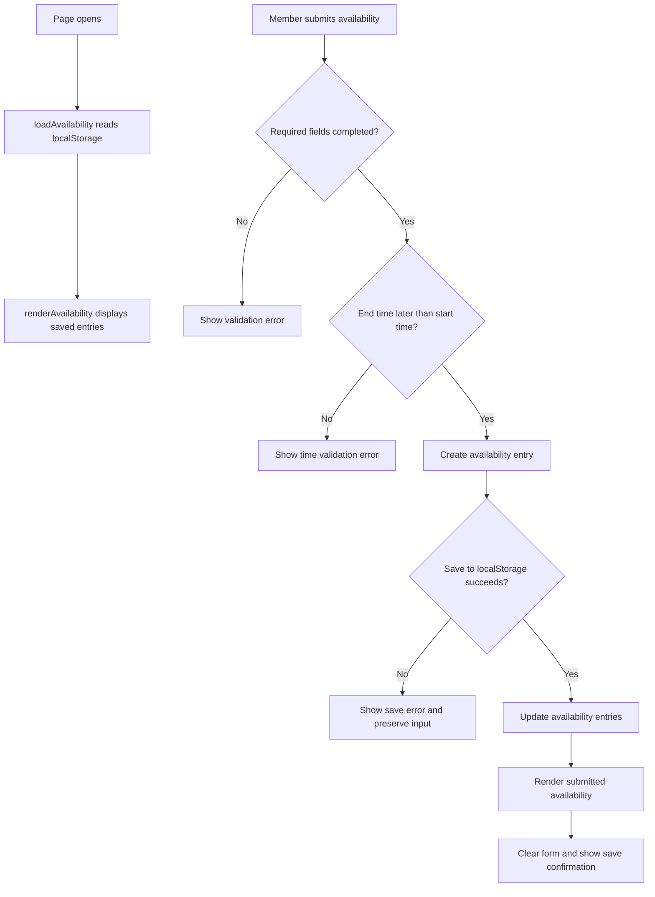

# Dance Team Member Availability

<!-- Badges are optional but cheap. shields.io generates them from a URL. -->

## What

Dance Team Member Availability is a browser-based feature that helps competitive dance team members record times when they are unavailable for practice. Members can submit a date, start time, end time, and an optional academic conflict/reason. The application saves and displays submitted availability so that scheduling constraints can be recorded before practices are planned. The broader problem is described in [PROJECT.md](context/PROJECT.md), and the feature requirements and acceptance criteria are documented in [FEATURES.md](context/FEATURES.md).

## See It Work

The screenshot demonstrates the selected EARS acceptance statement: when a member submits unavailable times, the system saves and displays the submitted availability. The saved entry appears under **Submitted Availability** after submission.

## How to Run

Create your repository from the this HW3 template and name it `mgt3745-hw3`. The supplied app is a starter; adapt it to one feature from your own specification.
This project runs inside a GitHub Codespace. No local install.

1. On your repository page, click **Code → Codespaces → Create codespace on main**. Wait for setup to finish; first-boot time varies.
2. Keep the supplied `.devcontainer/devcontainer.json`. It configures Live Server installation and port 5500 forwarding. Once the extension is ready, right-click `index.html` and choose **Open with Live Server**, or use **Go Live**.
3. If a browser tab does not open, use the **Ports** tab to open port 5500. Keep its visibility **Private**.
4. With Live Server running, save your edits to reload the page.

If Live Server is unavailable, run `node scripts/serve.mjs` in the terminal, then open port 5500 from the Ports tab. Refresh the browser after edits when using this fallback; stop it with **Ctrl+C**. Run only one server on port 5500 at a time. The fallback also works locally with Node 22 or later. Serve over HTTP rather than opening `index.html` through `file://`.

<!-- The .devcontainer folder installs Live Server automatically. If the right-click option
     is missing, wait for the extension to finish installing (bottom-left status bar), or run
     `python3 -m http.server 5500` in the terminal and open port 5500 from the Ports tab.
     Edit these steps if your feature needs anything more. -->

## How It Works

When the page loads, `loadAvailability()` reads previously saved availability from browser `localStorage`, and `renderAvailability()` displays those entries. When a member submits the form, the application checks that the required fields are complete and that the end time is later than the start time. A valid entry is saved to `localStorage` before the visible state is updated. User-provided text is displayed with `textContent` rather than `innerHTML`. If the storage write fails, the application displays an error and preserves the member's unsaved input.

## Status

| Area | State | Why |
|------|-------|-----|
| Save and display | [Works] | Submitted availability was saved and displayed successfully. |
| Invalid input | [Works] | An end time earlier than the start time was rejected with a validation message. |
| Data survives reload / storage failure | [Works] | The saved availability remained visible after refreshing the page. |
| Multi-user sync (starter limitation) | Deferred | Browser-local storage does not provide sync. Explain your own scope and decision in [ADR-001](context/ARCHITECTURE.md). |

Verification results (click to expand)

The full acceptance-statement verification record is available in [FEATURES.md](context/FEATURES.md).

| Criterion / EARS statement | Steps and input | Expected result | Observed result | Status | Evidence / commit |
|---|---|---|---|---|---|
| Save and display availability | Submitted a date, start time, end time, and academic conflict/reason | Entry is saved and displayed | Entry appeared under Submitted Availability | PASS | [Screenshot](docs/hw%203%20screenshot.png) |
| Invalid time range | Entered a start time of 9:00 PM and an end time of 7:00 PM, then submitted the form | The application rejects the invalid time range | The application displayed "End time must be later than start time." | PASS | [Verification](context/FEATURES.md) |
| Persistence after reload | Saved an availability entry and refreshed the page | The saved availability stayed even after the page reloaded | The previously saved entry was visible after refresh | PASS | [Verification](context/FEATURES.md) |

## Links

Read in this order:

0. [`SCAFFOLD_MANIFEST.md`](SCAFFOLD_MANIFEST.md): explains what carries over from HW2 into HW3, along with a submission checklist
1. [`context/PROJECT.md`](context/PROJECT.md): the problem and its framing
2. [`context/USERS.md`](context/USERS.md): who this is for
3. [`context/FEATURES.md`](context/FEATURES.md): what it must do, and verification results
4. [`context/ARCHITECTURE.md`](context/ARCHITECTURE.md): the gate and ADR-001
5. [`context/STANDARDS.md`](context/STANDARDS.md): the rules this code follows
6. [`context/CLAUDE.md`](context/CLAUDE.md): the same rules, for agents

The scaffold has **eleven canonical files in `/context`: six active files above and five previews**: [STYLE.md](context/STYLE.md), [TOOLS.md](context/TOOLS.md), [SKILLS.md](context/SKILLS.md), [EVALS.md](context/EVALS.md), and [AGENTS.md](context/AGENTS.md). Keep the previews; verification stays in FEATURES.md until EVALS.md activates in Module 5.

## AI Use

**Tool and task delegated:** ChatGPT was used to help organize the Build-Buy-Delegate Gate and ADR, and structure the order in which I completed the required sections.

**Why:** I used AI to make the assignment easier to follow and organize my thoughts clearly.

**How it was checked:** I reviewed the final project myself and manually tested the application in my Github Codespace.

**Observed result / evidence:** I verified that availability could be submitted and displayed, remained after the page was refreshed, and that an invalid time range was rejected. See the [verification results](context/FEATURES.md) and [screenshot](docs/hw%203%20screenshot.png).

**Instruction discovery and compliance:** Not run. I manually reviewed the final project against the repository instructions and standards. 

## Explain, Change, Verify

Explain: The 'saveAvailability()' function takes the updated list of availability entries and saves it to 'localStorage'. If the save is successful, it returns 'true'. If the save fails, it displays an error message and returns 'false'. 

Change: I changed the starter application from a meeting notes example into a member availability feature for my competitive dance team scheduling problem. The application now lets a member enter a date, start time, end time, and optional reason for not being available that day. This change supports F-01 in my FEATURES.md because members need a way to enter and save their unavailable times. The implementation change can be viewed in the [app.js commit](https://github.com/RishiA10/mgt3745-hw3/commit/08712fd30d38205791338cf8fad0fc0587d62ab6).

Verify: I ran the application using Live Server in my GitHub Codespace. I submitted an availability entry and confirmed that it appeared under Submitted Availability. I refreshed the page and confirmed that the entry remained there. I also tested an invalid time range by making the end time earlier than the start time, and the application displayed an error message. See the [verification results](context/FEATURES.md) and [screenshot](docs/hw%203%20screenshot.png).  
